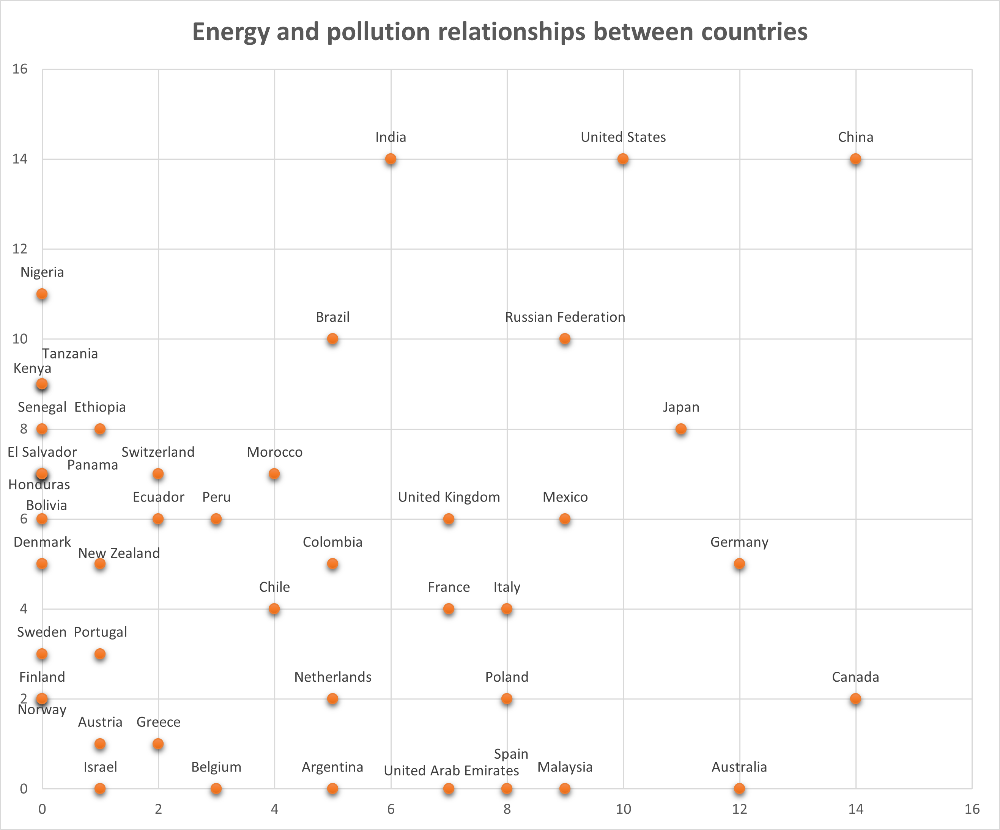

# SOM_energy
This is an implementation of a **Self Organizing Map** that pretends to analyze the similitude between some countries in the energetic field.
The data was obtained from the [World Bank](https://databank.worldbank.org/createreport).

The list of countries is
1.	Argentina
2.	Australia
3.	Austria
4.	Belgium
5.	Bolivia
6.	Brazil
7.	Canada
8.	Chile
9.	China
10.	Colombia
11.	Denmark
12.	Ecuador
13.	El Salvador
14.	Ethiopia
15.	Finland
16.	France
17.	Germany
18.	Greece
19.	Honduras
20.	India
21.	Israel
22.	Italy

Here is the result.

The indicators taken into account are: 
1.	Access to electricity (% of population)
2.	Adjusted savings: carbon dioxide damage (current US$)
3.	Adjusted savings: particulate emission damage (current US$)
4.	CO2 emissions (metric tons per capita)
5.	CO2 emissions from solid fuel consumption (% of total)
6.	Electric power consumption (kWh per capita)
7.	Electricity production from renewable sources, excluding hydroelectric (% of total)
8.	Electricity production from hydroelectric sources (% of total)
9.	Electricity production from nuclear sources (% of total)
10.	Fossil fuel energy consumption (% of total)
11.	Methane emissions in energy sector (thousand metric tons of CO2 equivalent)
12.	Nitrous oxide emissions in energy sector (thousand metric tons of CO2 equivalent)
13.	PM2.5 air pollution, population exposed to levels exceeding WHO guideline value (% of total)
14.	Renewable electricity output (% of total electricity output)
15.	Renewable energy consumption (% of total final energy consumption)
16.	Total greenhouse gas emissions (kt of CO2 equivalent)

The file with the raw data can be found in...
